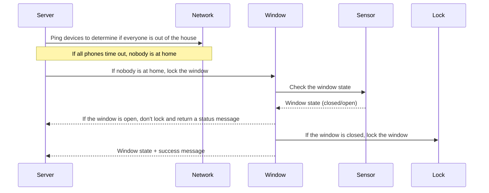
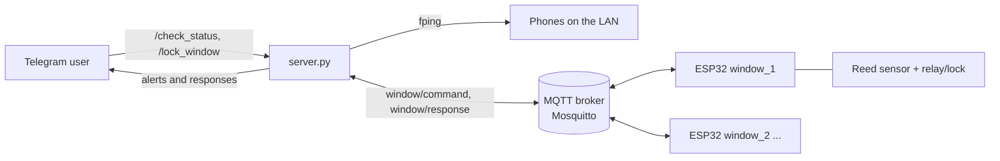

# Window Lock

An automated locking system for **physical windows** in a home (not Microsoft Windows PCs).
Each window gets an ESP32 with a magnetic contact sensor and a relay-driven lock. A small Python
server, for example on a Raspberry Pi Zero W, talks to the ESP32 clients over MQTT, exposes
a Telegram bot for status checks and lock commands, and pings the household's phones to tell
you when nobody seems to be home.

> [!WARNING]
> This project drives physical locks. Read the [Safety](#safety) section before you install it.

## Table of contents

- [Features](#features)
- [How it works](#how-it-works)
- [Hardware and wiring](#hardware-and-wiring)
- [Software requirements](#software-requirements)
- [Setup](#setup)
- [Configuration](#configuration)
- [MQTT topics and payloads](#mqtt-topics-and-payloads)
- [Usage](#usage)
- [Troubleshooting](#troubleshooting)
- [Safety](#safety)
- [Security notes](#security-notes)
- [Contributing](#contributing)
- [License](#license)

## Features

### Server (`server.py`)

- Publishes commands to all window clients at once, or to one client by its ID.
- Provides Telegram commands for status checks (`/check_status`) and locking (`/lock_window`).
- Forwards every client response to a Telegram chat as `[<client_id>] <message>`.
- Pings a list of network devices (such as phones) with `fping` every 60 seconds and sends a
  Telegram alert when none of them respond.

### Client (`esp.cpp`, ESP32)

- Responds to MQTT commands to report the window state or lock the window.
- Reads the window state from a magnetic contact sensor (closed or open).
- Locks only when the window is closed; otherwise it reports that it can't lock.
- Ignores commands addressed to a different `client_id`, so many windows can share one broker.

## How it works


The same design as a Mermaid diagram (source: [`Architecture/sequence-diagram.txt`](Architecture/sequence-diagram.txt)):



### How the diagram maps to the code

| Diagram step | Code |
|---|---|
| Server pings devices | `monitor_devices()` in `server.py` runs `fping -c1 -t300 <ip>` for each entry in `MONITORED_DEVICES`, every 60 s, in a background thread. |
| "Nobody at home" | When **all** devices fail to respond, the server sends the Telegram alert `No monitored devices are responding!`. |
| Server tells the window to lock | **Manual in the current code.** The server does **not** lock automatically when nobody is home; you send `/lock_window` from Telegram, which publishes `{"command": "lock_window"}` to `window/command`. |
| Window checks the sensor | `callback()` in `esp.cpp` reads `magnetSensorPin` (`HIGH` = closed, `LOW` = open). |
| Window is open | The client publishes `Window is open, cannot lock` to `window/response`. |
| Window is closed, lock it | The client pulls `relayPin` `LOW` for 1 second, then back `HIGH`, and publishes `Window locked`. |
| Response back to the server | `on_mqtt_message()` in `server.py` forwards each response to the Telegram chat `ALERT_CHAT_ID`. |



There is no unlock command: the lock is pulsed once, and unlocking is done by hand or by the lock
mechanism itself. <!-- TODO: verify which lock/actuator the 1 s pulse is designed for -->

## Hardware and wiring

Per window:

- An **ESP32** development board. The sketch uses the ESP32 `WiFi.h` library, so it does not build
  as-is on an ESP8266.
- A **magnetic contact (reed) sensor** on the window frame.
- A **relay module** that switches the lock actuator. The code treats the relay as **active-LOW**
  (`LOW` = on, `HIGH` = off).
- A **lock actuator** (for example a solenoid or electric latch) and a power supply suited to it.
  <!-- TODO: verify actuator type and voltage -->

Pins, from `esp.cpp`:

| Constant | GPIO | Mode | Connects to | Logic |
|---|---|---|---|---|
| `magnetSensorPin` | 2 | `INPUT` | Magnetic contact sensor | `HIGH` = window closed, `LOW` = window open |
| `relayPin` | 4 | `OUTPUT` | Relay module input | Idle `HIGH` (off); pulsed `LOW` for 1 s to lock |

Wiring notes:

- `magnetSensorPin` is configured as a plain `INPUT` without the internal pull-up, so the sensor
  circuit must pull the pin to a defined level on its own (for example, an external resistor).
  <!-- TODO: verify intended sensor wiring (pull-up vs pull-down) -->
- GPIO 2 is a boot strapping pin on the ESP32 and drives the on-board LED on many dev boards. If the
  board fails to boot or flash with the sensor attached, move the sensor to another GPIO and change
  `magnetSensorPin`.
- Power the lock actuator from its own supply through the relay, not from the ESP32's 3.3 V pin.

Server host:

- Any Linux machine that can run Python 3, Mosquitto and `fping` on the same LAN as the phones.
  A Raspberry Pi Zero W is the intended target.

## Software requirements

### ESP32 client

- [Arduino IDE](https://www.arduino.cc/en/software) with the **esp32** board package by Espressif.
- Libraries (install from the Library Manager):
  - **PubSubClient** by Nick O'Leary (MQTT client).
  - **ArduinoJson** by Benoit Blanchon. The sketch uses `DynamicJsonDocument`, which is the
    ArduinoJson 6 API (version 7 still accepts it, with deprecation warnings).

### Server

- Python 3.12 or older, with `venv`. python-telegram-bot 13.x imports the `imghdr` module, which was removed in Python 3.13.
- System packages: `fping`, `mosquitto` (the MQTT broker), and optionally `mosquitto-clients` for testing.
- Python packages (there is no `requirements.txt`; these come from the imports in `server.py`):

| Import | Package | Notes |
|---|---|---|
| `paho.mqtt.client` | `paho-mqtt` | Use `paho-mqtt<2`: `mqtt.Client()` is called without the `callback_api_version` argument that paho-mqtt 2.x requires. |
| `telegram`, `telegram.ext` (`Updater`, `CommandHandler`, `CallbackContext`) | `python-telegram-bot` | Use `python-telegram-bot==13.*`: `Updater(token)` and `updater.dispatcher` were removed in version 20. |
| `os`, `time`, `json`, `threading` | standard library | |

## Setup

### 1. MQTT broker and server

```bash
sudo apt install fping mosquitto mosquitto-clients python3-venv -y
```

Mosquitto 2.x only accepts connections from the local machine with its stock config, but the ESP32
clients connect over the network, anonymously, on port 1883. Allow that with
`/etc/mosquitto/conf.d/window-lock.conf`:

```conf
listener 1883
allow_anonymous true
```

Anonymous access is needed because the code has no MQTT authentication; read
[Security notes](#security-notes) before exposing the broker. Then restart Mosquitto:

```bash
sudo systemctl restart mosquitto
```

Install the Python packages in a virtual environment (Debian and Raspberry Pi OS block system-wide
`pip install` under PEP 668):

```bash
cd /home/pi/window-lock
python3 -m venv .venv
.venv/bin/pip install "python-telegram-bot==13.*" "paho-mqtt<2"
```

Create a Telegram bot with [@BotFather](https://t.me/BotFather), get its token, and find the chat
ID the alerts should go to. Then edit the constants at the top of `server.py`
(see [Configuration](#configuration)) and start it:

```bash
.venv/bin/python server.py
```

To run it at boot, a minimal systemd unit could look like this (adjust the user and path):

```ini
# /etc/systemd/system/window-lock.service
[Unit]
Description=Window lock server
After=network-online.target mosquitto.service
Wants=network-online.target

[Service]
User=pi
WorkingDirectory=/home/pi/window-lock
ExecStart=/home/pi/window-lock/.venv/bin/python /home/pi/window-lock/server.py
Restart=on-failure

[Install]
WantedBy=multi-user.target
```

```bash
sudo systemctl daemon-reload
sudo systemctl enable --now window-lock
```

### 2. ESP32 client (Arduino IDE)

1. Install the esp32 board package and the PubSubClient and ArduinoJson libraries.
2. Arduino IDE opens `.ino` sketches, so create a sketch folder (for example `window_client/`) and
   copy the contents of `esp.cpp` into `window_client/window_client.ino`.
3. Add `#include <ArduinoJson.h>` below the existing includes. The sketch uses ArduinoJson but
   does not include it, so it won't compile without this line.
4. Set the Wi-Fi credentials, the broker address and a **unique** `client_id` for this window
   (see [Configuration](#configuration)).
5. Select your ESP32 board and port, then upload.
6. Open the Serial Monitor at **115200** baud. You should see `Connecting to Wi-Fi...` followed by
   `Wi-Fi connected`.

Repeat for every window, giving each one its own `client_id` (`window_1`, `window_2`, …).

## Configuration

All settings are constants in the source files. There are no config files, environment variables
or command-line flags.

### `esp.cpp`

| Constant | Default | Description |
|---|---|---|
| `ssid` | `"YOUR_WIFI_SSID"` | Wi-Fi network name. |
| `password` | `"YOUR_WIFI_PASSWORD"` | Wi-Fi password. |
| `mqtt_server` | `"YOUR_MQTT_BROKER_IP"` | IP address or hostname of the MQTT broker (the server host). |
| `client_id` | `"window_1"` | Unique ID of this window. Used as the MQTT client ID and to filter targeted commands. |
| `magnetSensorPin` | `2` | GPIO of the magnetic contact sensor. |
| `relayPin` | `4` | GPIO of the relay that drives the lock. |
| MQTT port | `1883` | Hard-coded in `client.setServer(mqtt_server, 1883)`. |

### `server.py`

| Constant | Default | Description |
|---|---|---|
| `MQTT_BROKER` | `"localhost"` | MQTT broker host. |
| `MQTT_PORT` | `1883` | MQTT broker port. |
| `TOPIC_COMMAND` | `"window/command"` | Topic the server publishes commands to. |
| `TOPIC_RESPONSE` | `"window/response"` | Topic the server listens on for client responses. |
| `TELEGRAM_BOT_TOKEN` | `"YOUR_TELEGRAM_BOT_TOKEN"` | Token from @BotFather. |
| `ALERT_CHAT_ID` | `"YOUR_TELEGRAM_CHAT_ID"` | Telegram chat that receives responses and alerts. |
| `MONITORED_DEVICES` | `["192.168.1.10", "192.168.1.11"]` | IP addresses of the devices (such as phones) used to detect presence. |

The topic names are also hard-coded in `esp.cpp` (`window/command`, `window/response`). If you
change them in `server.py`, change them in the sketch as well.

Neither side sets MQTT credentials or TLS; see [Security notes](#security-notes).

## MQTT topics and payloads

Messages are JSON, published with QoS 0 and not retained.

| Topic | Direction | Payload | Meaning |
|---|---|---|---|
| `window/command` | Server → clients | `{"command": "get_status"}` | Every client reports its state. |
| `window/command` | Server → clients | `{"client_id": "window_1", "command": "get_status"}` | Only `window_1` reports its state. |
| `window/command` | Server → clients | `{"command": "lock_window"}` | Every client tries to lock. |
| `window/command` | Server → clients | `{"client_id": "window_1", "command": "lock_window"}` | Only `window_1` tries to lock. |
| `window/response` | Client → server | `{"client_id": "window_1", "message": "Window is closed"}` | Reply to `get_status` (`closed` or `open`). |
| `window/response` | Client → server | `{"client_id": "window_1", "message": "Window locked"}` | Lock pulse sent. |
| `window/response` | Client → server | `{"client_id": "window_1", "message": "Window is open, cannot lock"}` | Lock refused because the window is open. |

You can test a client without the server:

```bash
mosquitto_sub -h <broker> -t window/response &
mosquitto_pub -h <broker> -t window/command -m '{"client_id":"window_1","command":"get_status"}'
```

## Usage

Send these commands to your bot in Telegram:

| Command | Effect |
|---|---|
| `/check_status` | Asks every window for its state. The bot replies `Requested status from all clients`. |
| `/check_status window_1` | Asks only `window_1`. |
| `/lock_window` | Sends a lock command to every window. |
| `/lock_window window_1` | Sends a lock command only to `window_1`. |

Each client's answer arrives in the `ALERT_CHAT_ID` chat, for example `[window_1] Window is closed`.

While none of the `MONITORED_DEVICES` respond to ping, the bot sends
`No monitored devices are responding!` once per minute. Locking is then up to you: send
`/lock_window`.

## Troubleshooting

| Symptom | Likely cause |
|---|---|
| Sketch fails to compile with `'DynamicJsonDocument' was not declared in this scope` | Add `#include <ArduinoJson.h>` and install the ArduinoJson library. |
| Compile errors about `setup_wifi` or `callback` not declared | The file was compiled as `.cpp`. Copy it into an `.ino` sketch (Arduino generates the prototypes), or add forward declarations. |
| Serial Monitor prints dots forever | Wrong `ssid`/`password`, or the network is 5 GHz only (the ESP32 needs 2.4 GHz). |
| Client never responds | Wrong `mqtt_server`; Mosquitto 2.x still in local-only mode (add the `listener 1883` / `allow_anonymous true` config from [Setup](#1-mqtt-broker-and-server)); broker port 1883 blocked; or two boards using the same `client_id` (the broker disconnects one of them each time the other connects). |
| Board crashes or reboots on a message | The sketch expects a JSON object with a `command` field; malformed or missing `command` can crash it. Send only the payloads listed above. |
| `server.py` fails at `mqtt.Client()` | paho-mqtt 2.x is installed. Install `paho-mqtt<2`. |
| `server.py` fails at `Updater(TELEGRAM_BOT_TOKEN)` or `updater.dispatcher` | python-telegram-bot 20+ is installed. Install version 13. |
| Telegram alert repeats every minute | Expected while all monitored devices are offline. Phones in deep sleep may stop answering ping; add more devices or use static DHCP leases. |
| Status is always `open` (or always `closed`) | Sensor wiring or pull resistor. See [Hardware and wiring](#hardware-and-wiring). |

## Safety

This project switches physical locks. Treat it as a convenience, not as a security or safety device.

- **Test carefully** on the bench before fitting it to a window, and again after every change.
- **Don't rely on it** to secure your home or to keep anyone safe. Presence detection by ping is
  unreliable (phones sleep, change IP or leave Wi-Fi), and the lock is only pulsed with no feedback
  that it actually engaged.
- **Keep a manual override.** Every window must stay openable by hand from the inside, without power
  and without the network, for example in a fire.
- Check your local building and fire regulations before locking windows automatically.
- Use a relay and power supply rated for your lock actuator, and fuse the actuator circuit.

## Security notes

- **Restrict MQTT.** The code connects to the broker without a username or password and without TLS.
  Enable authentication and ACLs on Mosquitto, and preferably TLS (port 8883). Supporting this
  requires changes to both `esp.cpp` and `server.py`.
- **Don't expose the broker** to the internet. Anyone who can publish to `window/command` can lock
  windows or read their state.
- **Restrict the Telegram bot.** The command handlers don't check who sent the command, so anyone
  who finds your bot can use it. Keep the bot private and consider filtering by chat ID.
- **Keep secrets out of git.** Don't commit your real Wi-Fi password, broker address or Telegram
  token; keep the placeholders in the repository.

## Contributing

Issues and pull requests are welcome. Please describe the hardware you tested with, and keep the
constants in the repository as placeholders.

## License

Licensed under the [Apache License 2.0](LICENSE).
